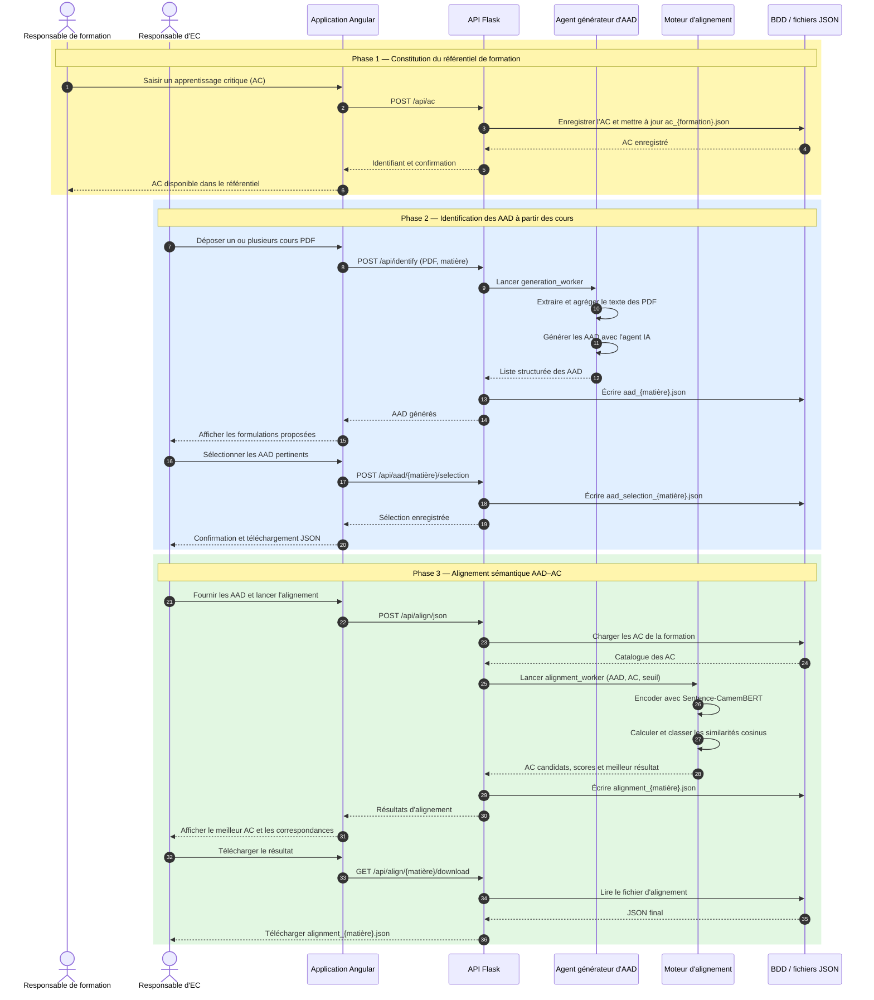

# Diagramme de séquence — génération et alignement des AAD

**Figure — Flux centralisé de génération et d'alignement des acquis d'apprentissage disciplinaires (AAD) avec les apprentissages critiques (AC).**

